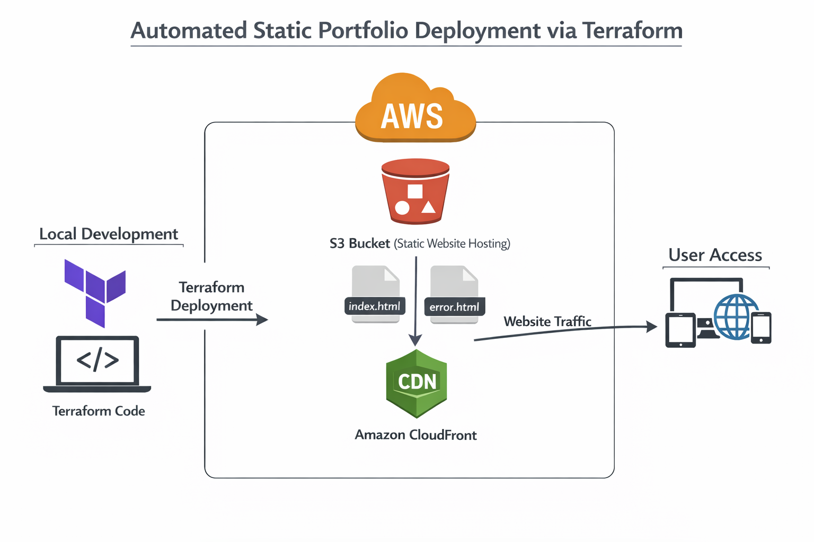

# Automated Static Portfolio Website Deployment on AWS S3 using Terraform as Infrastructure as Code




## 📌 Project Overview

This project demonstrates the use of **Terraform** to provision and manage cloud infrastructure for a **static portfolio website** using **Infrastructure as Code (IaC)** principles.

All infrastructure components required to host the website are defined declaratively, allowing the entire environment to be **reprovisioned, modified, or destroyed consistently** using Terraform.


## 🎯 Objectives

* Automate static website deployment using Terraform
* Practice Infrastructure-as-Code best practices
* Gain hands-on experience with Terraform providers, state management, and troubleshooting
* Eliminate manual cloud configuration and configuration drift


## 🛠️ Technologies Used

* **Terraform**
* **Cloud Provider** (e.g., AWS)
* **Git & GitHub**
* **Static Website Technologies** (HTML, CSS)


## 🚀 How to Deploy

### 1️⃣ Prerequisites

Ensure you have:

* Terraform installed
* Cloud provider credentials configured
* Git installed


### 2️⃣ Initialize Terraform

```bash
terraform init
```


### 3️⃣ Review the Execution Plan

```bash
terraform plan
```

---

### 4️⃣ Apply the Configuration

```bash
terraform apply
```

Confirm with `yes` when prompted.


### 5️⃣ Access the Website

After deployment, Terraform outputs will display the URL or endpoint where the static website is hosted.


## 🔄 Infrastructure Lifecycle Management

To destroy all resources:

```bash
terraform destroy
```

Project Outcome


## 🧠 Key Concepts Demonstrated

* Infrastructure as Code (IaC)
* Terraform providers and resources
* State management and persistence
* Declarative infrastructure
* Idempotent deployments
* Debugging and resolving real-world Terraform errors

---

## ⚠️ Challenges & Lessons I Learnt

* Managing provider authentication securely
* Understanding Terraform state behavior after environment restarts
* Handling existing resources vs newly created ones
* Resolving repository and cloud resource conflicts
* Avoiding hardcoded values using variables and data sources

These challenges strengthened my understanding of **real-world DevOps workflows**.


## 📈 Future Improvements

* Introduce Terraform modules for better reusability
* Implement remote state with locking
* Add CI/CD pipeline for automated deployments
* Separate environments (dev / prod)
* Integrate CDN for improved performance


